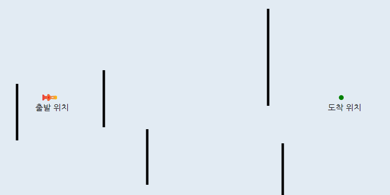
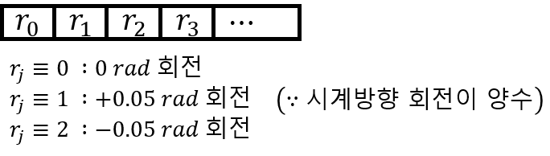

# RocketPath_GA
유전 알고리즘(GA - Genetic Algorithm)을 이용한 로켓의 경로 찾기 구현

## 0. 그대로 실행 시 주의사항
그대로 실행 시, 하위 디렉토리 ```\datas``` 에 그래픽화한 이미지 및 데이터들을 모두 저장하도록 되어 있습니다.
수많은 파일을 생성하고 싶지 않다면, ```Program.cs``` 에서 ```RocketGene```클래스의 ```CalNextGene()``` 함수를 수정하세요.

## 1. 유전 알고리즘 (Genetic Algorithm)
 자연의 진화과정에 기초한 계산 모델로써, 해를 유전자 형식으로 표현하고 적합도 함수(fitness function)를 통해 선택, 교배, 변이 등의 과정을 거치며 최적의 해(유전자)를 찾아가는 알고리즘
 
## 2. 문제 상황 설정


**상황** : 로켓이 출발 위치 에서 출발

**구하려는 해** : 출발 위치 → 도착 위치 이동 경로

**조건** : 장애물이 존재함 (검은색 선)

**각 로켓의 점수** : 도착 위치 까지의 거리

## 3. 유전 알고리즘 적용

### 3.1. DNA 구조 설계
 로켓의 운동 방향 회전 정보



### 3.2. DNA 개수
 20개

### 3.3. 돌연변이 확률
 5%

### 3.4. 교배 규칙
**1)** 점수(거리) 상위 50% DNA보존

**2)** 하위 50% DNA는 상위 50% 교배 DNA로 교체

**3)** 상위 50% DNA 교배 시, 점수에 비례해 유전 인자 결정

### 3.5. 로켓의 운동 방법
 속도의 크기는 2로 상수값
 
 
